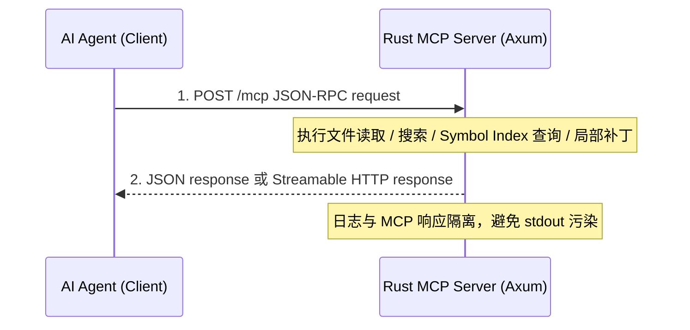

# Rust MCP (Model Context Protocol) 服务开发与高精度语义图谱设计指南

本指南专为需要开发、维护高可用 AI Agent 工具箱的开发者编写。本文档不仅阐述了**为什么选择 Rust 开发 MCP 服务**以及**Rust 核心概念**，还规划了一条循序渐进的落地路线：先实现稳定的基础文件工具，再实现轻量级 **Symbol Index（符号索引）**，最后再从 Go 语言开始逐步进入更高级的 AST 语义分析。

---

## 目录
1. [为什么选择 Rust 实现 MCP 服务？](#1-为什么选择-rust-实现-mcp-服务)
2. [阶段化落地计划](#2-阶段化落地计划)
3. [Symbol Index 设计思想](#3-symbol-index-设计思想)
4. [基础文件工具设计](#4-基础文件工具设计)
5. [开发者极速通关：Rust 核心概念对比](#5-开发者极速通关rust-核心概念对比)
6. [Rust MCP 核心网络架构 (Streamable HTTP)](#6-rust-mcp-核心网络架构-streamable-http)
7. [如何配置和调试你的 Rust MCP 服务](#7-如何配置和调试你的-rust-mcp-服务)

---

## 1. 为什么选择 Rust 实现 MCP 服务？

在 Windows 环境下，传统的 Shell 命令行工具（如 PowerShell 脚本、`Select-String`）在面对大模型（Agent）的高频、长文本读写需求时，经常会因为**控制台编码、换行符污染、并发冲突**等原因崩溃。

选择 Rust 作为 MCP 服务的开发语言，有以下四个决定性优势：

* **冷启动近乎零延迟**：本地编译的 Rust 二进制文件没有虚拟机（JVM）或解释器（Node.js/Python）的加载开销，启动时间通常在几毫秒内。
* **彻底消灭乱码**：Rust 提供了优秀的标准库（`std::fs`），在底层直接与操作系统的文件系统进行字节级（Byte-level）交互。它读取文件并直接在内存中转化为标准 `UTF-8` 字符串，**完全不经过 Windows 控制台（CMD/PowerShell）的活跃代码页（Active Code Page）转换**。
* **完美支持 Streamable HTTP 网络传输，彻底解决 Stdout 污染**：Rust 拥有强大的 Web 异步生态（`axum` + `tokio`），能以极少的代码编写出极高性能的本地 HTTP MCP 服务，将“通信流”与“调试日志流”彻底隔离。
* **安全可靠**：Rust 的**所有权（Ownership）**和**借用检查器（Borrow Checker）**能在编译期杜绝数据竞争（Data Race）和并发读写冲突。

---

## 2. 阶段化落地计划

本项目的目标不是一上来做“终极语义图谱”，而是先把 AI 最常用、最容易被 Windows Shell 拖累的能力沉淀成稳定 MCP 工具。第一阶段完成后，Agent 在大多数“找代码、读代码、改代码”的场景里都不需要拼 PowerShell/CMD 命令。

### Phase 1：基础工具底座

先实现高频、稳定、结构化的基础能力：

| Tool | Purpose |
|------|---------|
| `workspace_info` | 返回 workspace root、平台、允许访问范围、忽略规则摘要 |
| `list_dir` | 安全列目录，支持递归深度、`.gitignore`、默认噪音目录过滤 |
| `read_file` | 读取小文件，带最大字节限制和 UTF-8 处理 |
| `read_file_lines` | 按行读取大文件片段，返回带行号内容 |
| `search_text` | 跨文件文本搜索，返回结构化匹配结果 |
| `write_file` | 在 workspace 内创建/覆盖文件，防路径穿越 |
| `replace_range` | 按行范围替换，比全局字符串替换更安全 |

### Phase 2：轻量 Symbol Index

在基础工具稳定后，实现轻量级符号索引。第一版只解决“在哪里”的问题，不做调用关系、不做接口实现推断、不做完整依赖链。

优先支持这五种常用语言：

| Language | First Symbols |
|----------|---------------|
| Rust | `fn`, `struct`, `enum`, `trait`, `impl method` |
| Go | `func`, method, `type struct`, `interface` |
| Python | `def`, `async def`, `class` |
| JavaScript | `function`, `class`, `export function`, `const name = (...) => ...` |
| TypeScript | `function`, `class`, `interface`, `type`, `enum`, arrow function |

对应 MCP 工具：

| Tool | Purpose |
|------|---------|
| `index_workspace` | 扫描 workspace 并构建符号索引 |
| `reindex_file` | 单文件增量重建 |
| `list_symbols` | 按文件或语言列出符号 |
| `search_symbols` | 对 name、signature、docstring 做 fuzzy search |
| `read_symbol` | 根据 symbol id 或坐标读取精确代码片段 |

### Phase 3：从 Go 开始进入 AST 深水区

高级 AST 能力先从 Go 试手。原因是 Go 语法稳定、类型系统清晰、工程项目中 Go 后端代码收益明显。

Go 进阶顺序：

1. 顶层符号抽取稳定化：函数、方法、结构体、接口。
2. 补齐注释与签名提取。
3. 只做直接引用搜索，不急着推断调用图。
4. 再研究 method receiver、包别名、接口实现、跨包引用。
5. 最后才考虑 dependency graph / call graph。

---

## 3. Symbol Index 设计思想

普通的 Agent 读代码是“盲人摸象”：给它一个文件，它就读一整篇；如果涉及跨文件调用，它只能用 Grep 瞎找，非常耗费 Token，且容易迷路。

第一版不做完整 Semantic Code Graph，而是先做一张稳定的 **Symbol Index**。它只回答一个问题：

> 我想找某个业务、函数、结构、类或接口，它在哪个文件、哪几行？

### 核心理念：“两阶段检索”范式（Two-Stage Retrieval）

1. **第一阶段：语义导航（地图检索）**
   当用户询问：“生成 PPT 相关的代码在哪里？”
   Agent 调用 Rust 的 `search_symbols(query: "生成ppt")` 工具。
   Rust 服务在毫秒级内检索所有节点名称和**中文业务注释**，返回相关的精简信息（只需几百个 Token）：
   > 🔍 找到匹配方法：`CreatePPT`
   > 📝 注释：`// CreatePPT 负责接收用户主题，调用大模型生成大纲，并分发的初始化任务`
   > 📍 **坐标**：`service/system/sys_ppt.go` [第 45 行 - 第 80 行]
2. **第二阶段：精准定位（微创手术式读写）**
   Agent 拿到坐标后，不再猜测，而是直接调用 `read_file_lines(file: "service/system/sys_ppt.go", start: 45, end: 80)` 进行精准阅读，或直接对该行范围下达修改指令。

---

### 符号节点数据结构设计

在 Rust 服务中，我们利用 `tree-sitter`（语法解析引擎）将代码解析为高层符号，并构建出包含**物理导航坐标（GPS）**的结构体。第一版不存依赖链：

```rust
use serde::{Serialize, Deserialize};

#[derive(Debug, Clone, Serialize, Deserialize)]
pub enum SymbolKind {
    Function,
    Method,
    Struct,
    Interface,
    Class,
    Enum,
    Trait,
    TypeAlias,
}

#[derive(Debug, Clone, Serialize, Deserialize)]
pub enum Language {
    Rust,
    Go,
    Python,
    JavaScript,
    TypeScript,
    Markdown,
}

#[derive(Debug, Clone, Serialize, Deserialize)]
pub struct SymbolNode {
    pub id: String,                 // 稳定 id，例如 "go:service/system/sys_ppt.go:CreateSession:23"
    pub name: String,               // 节点名称，例如 "CreatePPT"
    pub language: Language,         // 文件语言
    pub kind: SymbolKind,           // 符号类型
    pub signature: String,          // 完整签名，例如 "func (s *PptService) CreatePPT(ctx context.Context, cfg models.PPTConfig) (string, error)"
    pub docstring: String,          // 紧贴在符号上方的业务注释
    
    // 👇 精准 GPS 导航坐标，供 AI 直接定位读取
    pub file_path: String,          // 文件相对路径，例如 "service/system/sys_ppt.go"
    pub start_line: usize,          // 起始行号 (1-indexed)，例如 45
    pub end_line: usize,            // 结束行号 (1-indexed)，例如 80
}
```

### 提取注释与坐标的实现思路 (Go 语言示例)

在 Rust 中，可以使用 `tree-sitter-go` 来定位 `function_declaration` 或 `method_declaration`。

1. **定位坐标**：提取节点（Node）在源文件中的 `start_position().row` 和 `end_position().row`。
2. **抓取注释**：向上寻找紧邻的 `comment` 类型的兄弟节点，将多行 `//` 合并，作为 `docstring` 字段。
3. **提取签名**：截取函数体开始前的声明区域，归一化空白，作为 `signature`。
4. **暂不提取依赖链**：调用关系、接口实现、包别名解析留到 Go AST 进阶阶段。

---

## 4. 基础文件工具设计

基础文件工具是第一阶段核心，不是备用能力。它们负责把 AI 从 Windows Shell 的编码、引号、管道、沙盒初始化、stdout 污染等问题里解放出来。

### 工具一：按行精准读取文件 (`read_file_lines`)
避免把数千行的文件整个塞给 Agent，支持只读特定行：

```rust
use std::fs::File;
use std::io::{self, BufRead, BufReader};
use std::path::Path;

pub fn read_file_lines<P: AsRef<Path>>(path: P, start: usize, end: usize) -> io::Result<String> {
    let file = File::open(path)?;
    let reader = BufReader::new(file);
    let mut lines_content = Vec::new();

    for (index, line) in reader.lines().enumerate() {
        let current_line = index + 1;
        if current_line >= start && current_line <= end {
            lines_content.push(line?);
        } else if current_line > end {
            break;
        }
    }
    Ok(lines_content.join("\n"))
}
```

### 工具二：精准局部代码补丁工具 (`replace_range`)

不要使用简单的全局字符串替换作为第一版 patch 能力。真实代码中相同片段可能出现多次，`content.replace(search, replace)` 容易误改。

第一版采用按行范围替换，并支持 `expected_old_text` 或文件 hash 作为并发保护：

```rust
pub fn replace_range<P: AsRef<Path>>(
    path: P,
    start_line: usize,
    end_line: usize,
    replacement: &str,
    expected_old_text: Option<&str>,
) -> io::Result<()> {
    // 1. 读取文件
    // 2. 校验 start/end 合法
    // 3. 如果 expected_old_text 存在，先确认目标行内容一致
    // 4. 只替换指定行范围
    // 5. 原子写回或写临时文件后 rename
    Ok(())
}
```

### 工具三：智能安全目录树 (`list_dir`)

读取项目目录结构，并利用 `ignore` 库或手动读取 `.gitignore`，过滤掉诸如 `node_modules/`、`target/` 等无用目录，防止 Agent 被杂音淹没。

---

## 5. 开发者极速通关：Rust 核心概念对比

如果你熟悉 Go 语言，理解 Rust 并不难。这里为你提炼出阅读和编写 Rust 代码必须掌握的核心概念：

### 🔑 概念一：所有权 (Ownership) 与借用 (Borrowing)
* **规则**：Rust 中每个值都有一个变量作为它的**所有者（Owner）**。当所有者离开作用域时，内存会被自动释放。这避免了垃圾回收（GC）的开销。
* **借用**：
  * **只读借用 (`&T`)**：可以同时存在多个只读引用（如 `&String`），允许只读不改。
  * **可变借用 (`&mut T`)**：**同一时间只能存在一个可变引用**，用于修改数据，防止并发读写冲突。

### 🧵 概念二：双字符串类型
1. **`String`**：在堆上分配、可动态增长的 UTF-8 字符串（类似于 Go 中的 `string` 包装）。
2. **`&str`**：字符串切片，是对一段已有字符串的只读引用（类似于 Go 中的只读 `string` 视图）。
* **转换**：加 `&` 可以将 `String` 降级为 `&str`；调用 `.to_string()` 可以将 `&str` 升级为 `String`。

### 🛡️ 概念三：Result 与 ? 操作符 —— 完美的错误处理
Go 语言习惯返回 `(result, error)`，而 Rust 使用 `Result<T, E>`（要么成功 `Ok(val)`，要么失败 `Err(err)`）。
* **操作符 `?`（捷径）**：在 Go 中我们需要写大量的 `if err != nil { return nil, err }`。在 Rust 中，一个 `?` 就能搞定错误向上传播：
  ```rust
  let mut file = File::open("config.json")?; // 如果失败，自动 return Err，否则解包得到 file
  ```

---

## 6. Rust MCP 核心网络架构 (Streamable HTTP)

本项目不兼容旧式 SSE MCP 协议，直接从新的 **Streamable HTTP** 传输开始实现。目标客户端是 Codex 以及其他支持新版 MCP HTTP 传输的 Agent。

设计原则：

* 不使用 `stdio` 作为主通信方式，避免 stdout 日志污染 JSON-RPC。
* 不实现旧 `/sse` + `/message` 双端点兼容层。
* 统一使用 HTTP endpoint 承载 MCP JSON-RPC 请求和可选流式响应。
* 调试日志走 `tracing` / stderr / log file，不进入 MCP 响应体。
* 服务默认监听 `127.0.0.1`，只服务本机 Agent。



---

## 7. 如何配置和调试你的 Rust MCP 服务

用 Rust + Streamable HTTP 写好服务后，调试会变得很清爽：

1. **本地调试启动**：
   在终端运行：
   ```bash
   cargo run
   ```
   你所有的 `println!` 或调试 `log` 都会直接以漂亮的格式输出在控制台里，**完全不影响与 Agent 的 JSON-RPC 通信**！
2. **在 Agent 客户端中配置**：
   打开 MCP 配置文件，将 Stdio 命令配置换成 HTTP URL 指向即可。具体字段名以客户端实现为准，概念上类似：
   ```json
   {
     "mcpServers": {
       "rust-semantic-mcp": {
         "url": "http://127.0.0.1:3000/mcp"
      }
     }
   }
   ```

---

通过“基础文件工具”与“轻量 Symbol Index”的双重保障，这套 Rust MCP 架构会先解决最现实的问题：让 AI 不再依赖脆弱的 Windows Shell 完成日常代码阅读、搜索和局部修改。等基础能力跑稳，再从 Go 开始逐步进入 AST 引用分析和更完整的语义图谱。
