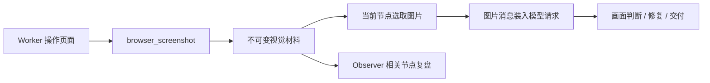

# Agent 页面截图与视觉检查实施计划

日期：2026-10-06。范围：Worker、Observer 的截图获取与看图能力，结合当前 Organizer / Scheduler / Flow。

## 一、目标

Agent 能启动项目、操作任务页面、截取当前画面，并让模型实际接收图片，判断与当前目标有关的渲染和交互表现。Observer 也能看图，检查组织者安排与节点交付是否符合用户目标。

本次是实施计划，不修改执行代码、不运行验收测试、不重启服务。

### 职责

| 角色 | 视觉职责 |
| --- | --- |
| Worker | 打开、点击、上传、执行交互；按需截图；检查当前节点画面，修复范围内的问题 |
| Organizer | 根据用户要求安排视觉验收节点；消费 Worker 交付与 Observer 建议，决定后续任务或回溯 |
| Observer | 查看相关截图与交付，判断范围、路径、结果是否偏离目标；必要时只读捕获当前任务页面的新画面 |
| 宿主 | 管理浏览器实例、不可变图片、请求身份、模型能力、图片消息和实际发送记录 |

Observer 可以独立判断，但不点击、上传、导航、写代码或重开完成节点。主动截图只针对当前任务授权的浏览器页面；建议仍交给 Organizer，不变成 Worker 的审批门禁。

## 二、已查明的现状

| 位置 | 现状 / 缺口 |
| --- | --- |
| `src/browser_control.rs` | 已有 browser_open/read/click/upload/screenshot；截图写入同一个 latest.png，只返回 path、bytes、matched |
| `src/mcp.rs` | 浏览器工具结果返回文本 JSON，没有图片内容块 |
| `src/agent_service.rs` | Worker 结果转成文本工具消息；尚无截图到图片消息的装配路径 |
| `src/observer_service.rs` | Observer 请求为 JSON 文本；尚无视觉附件或受限只读截图调用 |
| `src/browser_control.rs` 的 SESSION | 进程级单例页面，缺少 task/page 隔离，多个任务可能互相导航 |
| `src/vision_preprocess.rs` | 有图片引用和转文字描述机制，存在全局图片引用回退；不能拿来承载任务间的截图身份 |
| `src/agent.rs` | 已有视觉分析请求，但默认走既有子代理路由，未按 Worker / Observer 身份选择和记录 |
| `src/ai_proxy.rs` | 当前 ModelCapabilities 只有推理强度与 fast_mode，没有明确图片输入能力 |
| `src/work_scheduler.rs` | write_check 完成后封存节点，待检查时限制工具；视觉验收需要正确规划位置 |

已有截图保存、用户图片解析和文字页面读取，可复用其中的基础代码。不能直接把路径文本视为模型已经看过图片，也不能默认所有模型都支持图片。

## 三、统一的视觉材料层

建议新增 `src/visual_artifacts.rs`，复用现有数据库、材料索引和版本规则。

### 3.1 图片材料身份

```text
VisualArtifact
  artifact_id
  task_id, request_id, work_id, node_id, revision, plan_revision
  source_tool_call_id, source_event_id
  browser_session_id, page_id, page_epoch, capture_seq
  url, viewport, captured_at
  content_hash, mime_type, width, height, byte_size
  workspace_relative_path
  related_source_versions / server_build_id（确实已知时填写）
```

- 每张截图使用独立 artifact_id 和文件名。latest.png 可保留为人工快捷预览，不作为模型或历史记录的正式来源。
- 原始截图不可覆盖；相同内容可复用底层文件，但各次捕获的时间、页面与任务身份各自保留。
- 元数据存 SQLite，图片存工作区材料目录；Notebook 与节点交付只传 ID 和摘要。
- 由宿主校验文件、MIME、大小、尺寸、hash；读取指定 artifact_id，不接受模型任意传本地路径来冒充截图。
- 原图不默认作为长期记忆；结论可保存图片来源、适用范围、页面和构建版本。需要明确标记视觉判断与源码事实。

### 3.2 浏览器隔离

先把进程级唯一 SESSION 改为任务所有的会话/页面句柄。可以共用底层浏览器进程，但 task/page 归属必须独立。

每次工具执行由宿主绑定 task_id，不信任模型自报任务身份。Worker 操作只影响自己的页面。Observer 只读访问同任务允许观察的页面。

截图与页面操作按 page 锁协调，记录捕获时的 URL、viewport 和 page_epoch。截图期间若页面归属或导航版本变化，返回具体冲突或 uncertain，不错误地挂到原节点。结束时只清理本任务资源。

## 四、Worker 的图片输入链路



### 4.1 截图与查看工具

1. 扩展 browser_screenshot：返回 artifact_id、尺寸、页面身份、时间和 hash，截图成功只表示已捕获。
2. 新增 view_image：按 artifact_id 读取已有图片，返回宿主可识别的图片材料结果。与用户上传图片的旧 analyze_image 分清用途。
3. Worker 调用截图时，默认把本次图片选入下一次正常模型请求，无需额外“截图后再读图”模型轮。view_image 用于后续按需恢复、对比或查看上游明确导出的图片。
4. MCP 对外可返回 image 内容块；内置 Agent 从统一图片材料结果装配自身请求。两条路径都需验收，避免只打通其中一条。

### 4.2 请求装配

- 工具结果保留文本摘要和 call_id；图片通过统一消息适配层传入真实多模态请求。
- 若当前提供方不支持图片形式的 tool 消息，保留普通工具回执，并装配一条明确标注“宿主工具材料，不是新的用户指令”的图片消息。
- 复用已有提供方格式转换；按实际协议处理 image_url / 图片块，不能仅在 JSON 字符串中放 base64。
- 图片在最终请求打包时按 ID 读取和编码，持久状态不保存每轮 base64 副本。
- 检查 scoped/projected messages、历史恢复和上下文压缩：保留图片引用，不能把需要观看的图片压成路径后继续宣称已检查。
- 当前帧只装入本节点选择的图片，跨节点只继承显式交付的 artifact_id 和检查摘要。

### 4.3 预算与恢复

首版每次视觉请求默认最多两张图，适合当前画面或修改前后对比。默认以浏览器 viewport 截图为主，全页长图作为显式选项。

编码后的图片大小和像素预算独立于源码字符预算。过大图片可以生成受控缩放副本；保留原图与派生图关系。细节需要时按需查看原图或局部，不能因縮放丢字而判定元素不存在。

看过后，下一轮主要携带 VisualCheckResult 与图片指针。相同截图无新检查问题时复用已有判断；页面、文档、构建或交互状态变了以后，旧判断不证明当前画面。

## 五、模型图片能力与降级

ModelCapabilities 增加图片输入能力，区分 supported / unsupported / unknown，不靠模型名称猜测。Worker 与 Observer 分别依据实际 provider/model 路由判断。

| 情况 | 行为 |
| --- | --- |
| 当前角色支持图片输入 | 直接让该角色接收图片，保留自己的目的与上下文 |
| 明确不支持，且已配置可用视觉路由 | 使用同一视觉服务提取事实，返回来源绑定的视觉结果给当前角色；注明由视觉服务分析，记录额外调用 |
| 明确不支持且无视觉路由 | 保存截图并显示；视觉判断为 unavailable/uncertain，不自动换模型或假装已经看图 |
| 能力未知 | 明确暴露未知能力；若允许首次能力探测，只做一次有界尝试并缓存结论，不反复发送失败图片请求 |

现有图片转文字机制可以作为明确的降级路径。它不能静默移除图片，让调试界面仍显示“原模型已看图”。旧全局 visible image 回退不用于本功能，所有引用必须由请求和任务作用域解析。

不新增“视觉主管”角色；必要的视觉服务只是工具能力。Organizer 仍与 Worker 使用同一模型和独立上下文。

## 六、Observer 的视觉能力

### 6.1 优先复用已有截图

ObservationInput 增加 visual_artifacts 与 visual_check_result，保留完整执行身份、捕获时页面和版本。Observer 在视觉相关的 assignment / progress / handoff 中按需选择图片。

派发审查主要判断组织安排；已有参考图或相关上游截图时才附图。交付复盘优先检查当前结果截图。知识讨论或非视觉节点不自动附图、截图或产生视觉调用。

Observer 看图关注：当前交付是否覆盖用户要求，是否仍有明显缺失、裁切、错位、空白，检查对象是否是正确页面/文档，以及组织者是否忽略了必要步骤。普通语法和代码修复仍由 Worker 处理。

### 6.2 必要时主动只读截图

提供受限的 observe_page_snapshot 能力：

- 只能捕获当前请求、当前实例授权的任务页面，不导航、不点击、不上传，不浏览其他任务。
- 优先使用当前已有截图；只有没有相关图片、图片明显过期或需要新状态时才重新捕获。
- 若 Observer 使用工具调用，沿用单会话模型许可。一次观察最多一次新截图工具调用，再完成判断；限制该观察总耗时，禁止截图循环。
- 图片入参版本在取得时锁定；返回时节点已回溯或请求已替换，则挂回原实例历史，不污染当前建议。
- 页面变化导致截图无法确定归属时，记录 uncertain；Observer 可向 Organizer 建议安排 Worker 的聚焦验证节点。

Observer 的默认路径复用 Worker 截图并异步观察。任务结束时取消未完成的观察，不为了补齐看图判断延迟用户回答或新增结束后的模型循环。

### 6.3 建议与记忆

视觉建议带 artifact_id、页面身份、执行版本和判断依据。继续使用已修复的建议版本链、来源顺序和组织者处理机制。

记忆区分：截图中实际看到的内容、Worker 验证的交互结果、推测的原因。仅截图不能证明拖拽、删除、导出回读正常，也不能据画面缺少一个元素就断言解析器一定不支持它。

## 七、交付契约与 Flow

### 7.1 最小视觉检查结果

```text
VisualCheckResult
  identity
  artifact_ids
  checked_goal / expected_visible_result
  assessment: pass | issue | uncertain | unavailable
  observed_facts（附图片/区域引用）
  issues / limitations
  page_epoch / build_version（已知时）
  actor, model_route, request_trace_id, checked_at
```

assessment 是模型判断，不是证明页面绝对正确。程序校验图片确实发送、身份有效、结果对应任务要求；不能把截图 matched=true 当成 pass。

### 7.2 保持简单状态

沿用 ready/running/done，不增加视觉审批状态。

用户要求查看画面或验证渲染时，由 Organizer 安排一个 output 视觉验收节点，消费启动地址、文档与构建交付。代码写入+编译的小任务完成后保持封存，后续视觉检查是明确的下一件事。

若用户授权验证并修复当前页面，则视觉节点需有相应的修复范围或向 Organizer 交付问题；普通修复循环在授权节点内完成。Observer 发现问题由 Organizer 决定安排修复或 revisit。

`requires_browser` 仍表示已有浏览器检查契约；新增视觉要求要显式区分 DOM 文字确认与实际图片判断。DOM 的 matched=true、截图成功或截图文件存在，都不自动满足视觉验收。

### 7.3 前端与调试

- 工具结果展示截图缩略图、时间、URL、viewport，支持查看原图。
- Flow 当前/历史节点按实例展示截图、Worker 判断、Observer 判断与建议处理。晚到结果不改变当前高亮。
- 调试展示本轮送入模型的图片清单、尺寸、hash、角色、模型路由和使用原图/缩放图/文字降级情况。
- SSE 与材料索引只传 ID 和元数据，图片走任务归属校验后的读取接口。完整请求调试可以保留实际发送体，但 UI 默认折叠大段 base64，不重复向前端推送。

## 八、实施顺序

| 批次 | 文件范围 | 交付 |
| --- | --- | --- |
| 1：浏览器与图片材料 | browser_control.rs；新增 visual_artifacts.rs；数据库/图片读取接口 | 任务页面隔离、不可变截图、完整身份与元数据 |
| 2：Worker 看图 | mcp.rs、tools.rs、plugin_builtin.rs、agent_service.rs、消息转换模块、ai_proxy.rs | 截图/View 工具、真实图片输入、能力识别、压缩与历史恢复 |
| 3：视觉节点与结果 | work_scheduler.rs、work_organizer.rs、worker_unit.md、organizer_system.md、task_notebook.rs | 视觉验收节点、VisualCheckResult、限定输入与交付 |
| 4：Observer 看图 | observer_service.rs、observer_system.md、agent_service.rs | 复用相关截图、受限主动截图、异步取消、建议来源与版本隔离 |
| 5：展示和调试 | frontend/model、FlowView、工具结果组件、RequestContextPanel、request_context.rs | 图片预览、按实例判断、实际发送情况 |
| 6：验收 | 后端脚本模型测试、浏览器场景、前端重放与真实任务 | 以下场景及调用统计 |

前四批分别保持现有 Worker 独立执行能力和 Observer 可关闭。首版先完成完整 viewport 图片链路，局部定位、图片对比和更细的区域描述在实际需要时补充。

## 九、验收场景

| 场景 | 必须结果 |
| --- | --- |
| 截图到 Worker | HTTP 请求包含可解码的真实图片，hash/尺寸与保存材料相符，不是路径或 base64 文本说明 |
| Canvas / PPT 渲染缺失 | Worker 能看到画面，并明确指出实际缺失或 uncertain；DOM 文字不能替代该判断 |
| 修改前后对比 | 两张图片不可变，结论分别绑定正确版本 |
| 删除视觉节点 | 查看操作前/后画面，并结合节点状态确认目标删除；不能只凭截到一张图宣布成功 |
| Observer 关闭 | Worker 仍可完成视觉任务和交付 |
| Observer 复用截图 | 不为每次复盘重新截图，不增加 Worker 的意见回执轮 |
| Observer 主动截图 | 仅目标任务当前页面，工具次数与耗时有界；不能操作其他页面 |
| 两任务并行 | 各自页面、截图和模型上下文不串；不会继续使用进程级唯一 latest 作为身份 |
| 请求替换 / 节点回溯 | 旧截图和晚到判断保留历史，不作为新目标的当前材料或待办 |
| 文字压缩 / 会话恢复 | 必要图片可按 ID 重新装配，旧文字结果不会冒充当前视觉判断 |
| 模型不支持或请求失败 | 明确 unavailable/uncertain；有授权降级才使用视觉路由，并记录真实来源 |
| Observer 超时 / 任务结束 | 执行继续或结束，未评估明确标记，无长尾看图循环 |
| 图片过大 / 材料失效 | 有界处理并说明限制，不猜测看不到的细节，不反复查询同一无效材料 |
| 调试与 Flow | 能核对哪些图片发给哪个模型；当前、废弃节点各自显示正确图片和判断 |

自动回归检查消息和身份链路；真实模型检查实际看图质量，两者分别报告。至少用 PPT 编辑器执行一个“加载示例并判断画面”的任务，以及一个“删除视觉节点并确认变化”的任务。

报告 Worker / Observer 的模型调用数、截图数、图片数量与字节、视觉请求耗时、复用次数、降级情况、重复调用以及额外回执轮数（应为 0）。不得仅因 browser_screenshot 成功或全部单元测试通过就宣称画面验收完成。

## 十、完成标准

Worker 和 Observer 都具备实际图片输入或明确授权的视觉分析路径；截图有不可变身份并按任务和节点隔离；可主动查看而不发生无界循环；Observer 保持辅助职责；Flow 与调试能展示真实看图记录；真实 PPT 任务有可核对的视觉交付。

本计划不默认所有任务都做浏览器验收，不让代码小任务的 DONE 等待观察者，不扩大到无关的终端或工具重构。
